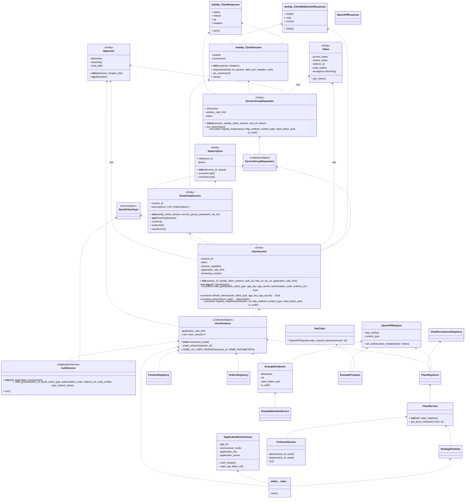

```mermaid
classDiagram

    class ApplicationEnvironment{
        - app_url
        - environment_mode
        - application_key
        - application_secret
        + auth_header()
        + open_api_base_url()
    }

    %% ==================== Session ==========================
    class aiohttp_ClientResponse{
        + status
        + reason
        + ok
        + headers
        + json()
    }
    class aiohttp_ClientWebSocketResponse{
        + closed
        + msg
        + receive
        + close()
    }
    aiohttp_ClientResponse <.. aiohttp_ClientSession
    aiohttp_ClientWebSocketResponse <.. aiohttp_ClientSession
    class aiohttp_ClientSession{
        - cookies
        - connections
        + __init__(connector, headers)
        + request(method, url, params, data, json, headers, auth)
        + ws_connect(url)
        + close()
    }
    class Token{
        <<Entity>>
        - access_token
        - refresh_token
        - redirect_uri
        - code_verifier
        - semaphoe refreshing
        + get_token()
    }
    class RateLimit {
        <<Entity>>
        - dimension
        - remaining
        - reset_after
        + __init__(dimension, header_info)
        + __eq__(dimension)
    }
    %%class TradeLevel {
    %%    <<Enumeration>> 
    %%}
    %%TradeLevel <.. SessionCapability
    %%class SessionCapability{
    %%    trade_level
    %%    NG: change_trade_level(trade_level)
    %%}
    %%class ContextId {
    %%    <<ValueObject>>
    %%    + __init__()
    %%}
    class Subscription{
        <<Entity>>
        + reference_id
        - queue
        + __init__(reference_id, queue)
        + coroutine get()
        + coroutine put()

    }
    %%ContextId <.. StreamingSession
    Subscription <.. StreamingSession
    aiohttp_ClientSession <.. StreamingSession
    ServiceGroupRequesters <.. StreamingSession
    class StreamingSession{
        <<Entity>>
        + context_id
        - subscriptions: List<~Subscription~>
        + __init__(aiohttp_client_session, service_group_requesters, ws_url)
        + __eq__(StreamingSession)
        + connect()
        + subscribe()
        + reauthorize()
    }
    %%RateLimit <.. SessionRateLimits
    %%class SessionRateLimits {
    %%    <<CollectionObject>>
    %%    - List<~rate_limit~>
    %%    + apply(dimension, header_info)
    %%    + throttle_time(dimension, time)
    %%}
    Token <.. ServiceGroupRequester: use
    RateLimit <.. ServiceGroupRequester
    aiohttp_ClientSession <.. ServiceGroupRequester
    aiohttp_ClientResponse <.. ServiceGroupRequester
    class ServiceGroupRequester{
        <<Entity>>
        + dimension
        - session_rate_limit
        - token
        + __init__(dimension, aiohttp_client_session, rest_url, token)
        + set_token(token)
        +coroutine request_response(url, http_method, content_type, need_token_auth, is_order)
    }
    ServiceGroupRequester <.. ServiceGroupRequesters
    class ServiceGroupRequesters{
        <<CollectionObject>>
    }
    class OAuthClientType{
        <<Enumeration>>
    }
    ServiceGroupRequesters <.. UserSession
    %%aiohttp_ClientSession <.. UserSession
    %%aiohttp_ClientResponse <.. UserSession
    aiohttp_ClientWebSocketResponse <.. UserSession
    %%ContextId <.. UserSession
    Token <.. UserSession: use
    OAuthClientType <.. UserSession: use
    StreamingSession <.. UserSession
    RateLimit <.. UserSession: use
    %%SessionRateLimits <.. UserSession: use
    %%SessionCapability <.. UserSession: has
    class UserSession{
        <<Entity>>
        - session_id
        - token
        - session_capability
        - application_rate_limit
        %%- session_rate_limits
        - streaming_session
        %%- context_association[context_id, streaming_session]
        + __init__(session_id, aiohttp_client_session, auth_url, rest_url, ws_url, application_rate_limit)
        -bool __eq__(self, UserSession)
        +coroutine code_grant(oauth_client_type, app_key, app_secret, authorization_code, redirect_uri): bool
        +coroutine refresh_token(oauth_client_type, app_key, app_secret): bool
        +coroutine subscribe(url, args): Subscription
        +coroutine request_response(dimension, url, http_method, content_type, need_token_auth, is_order)
    }
    UserSession <.. UserSessions
    RateLimit <.. UserSessions
    %% possible to have multiple sessions for a given user (by issuing multiple authorization tokens on the same user).
    class UserSessions{
        <<CollectionObject>>
        - application_rate_limit
        - List<~user_session~>
        + __init__(environment_mode)
        - create_session(session_id)
        + SAME_AS_USER_SESSION(session_id, SAME_PARAMETERS)
    }

    %% ==================== Auth ==========================
    OAuthClientType <.. AuthService
    UserSessions <.. AuthService
    class AuthService{
        <<ApplicationService>> 
        + __init__(self, application_environment)
        + code_grant(session_id, oauth_client_type, authorization_code, redirect_uri, code_verifier, auto_refresh_token)
        + run()
    }

    %% ==================== chart ==========================
    class ChartPersistenceRegistory{
        
    }
    OpenAPIRequest <.. ChartRegistory
    UserSessions <.. ChartRegistory
    ChartPersistenceRegistory <.. ChartRegistory
    class ChartRegistory{

    }
    ChartRegistory <.. ChartService
    class ChartService{
        + __init__(self, chart_registory)
        + get_price_info(asset, from, to)
    }
    UserSessions <.. PositionRegistory
    class PositionRegistory{

    }
    UserSessions <.. OrdersRegistory
    class OrdersRegistory{

    }
    ChartService <.. StrategyRuntime
    class StrategyRuntime{

    }
    ChartService <.. PreFetchService
    class PreFetchService{
        start(session_id, asset)
        stop(session_id, asset)
        run()
    }
    class NotClass{
        + OpenAPIRequest order_request_factory(amount: int)
    }
    class OpenAPIResponse{

    }
    class OpenAPIRequest{
        - http_method
        - content_type
        + set_authorization_header(token: Token)

    }
    OpenAPIRequest <.. ExampleEndpoint
    UserSessions <.. ExampleEndpoint
    class ExampleEndpoint{
        - dimension
        - url
        - need_token_auth
        - is_order
    }
    NotClass <.. ExampleProgram
    OpenAPIRequest <.. ExampleProgram
    class ExampleProgram{

    }
    ExampleEndpoint <.. ExampleDomainService
    class ExampleDomainService {

    }

    %% ==================== Winko ==========================
    StrategyRuntime <.. winko__main__
    ApplicationEnvironment <.. winko__main__
    UserSessions <.. winko__main__
    class winko__main__{
        main()
    }
```