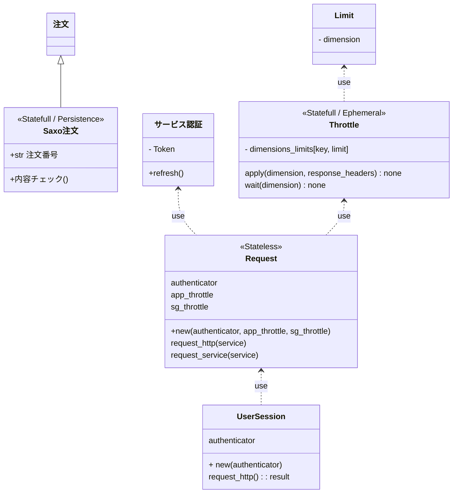

# Request/Response
## Access Limiting
- Saxobankの仕様では、エンドポイントのサービスグループ別にリクエストがカウントされる旨が明記されている。
    - しかし、どのエンドポイントリクエストに対して何がカウントされるのかは明記されていない。
    - あるエンドポイントへのカウンタが、そのエンドポイント専用のものとは限らず、他のエンドポイントへのリクエストに対して共通してカウントされるかもしれない。
        - 実際に、port/v1/positions/とport/v1/orders/は、どちらもPortfolioMinuteというディメンションで管理されるカウンタを消費する。
    - エンドポイントへのリクエストURLとHTTP-Methodをキーに、レスポンスに格納されているディメンションをバリューとして、動的に辞書を作っても良いが、それだと仮に連続してアクセスする個別のエンドポイントが共通のカウンタで管理されていた場合に、初回はWait時間を無視してアクセスしてしまうことになる。
    - プログラムの実行時に動的に辞書を組み立てるのではなく、予めどのエンドポイントに対してどのディメンションが返されるのかを確認し、そのAs-Isの動作を基に辞書を作っておくしかない。
        - ディメンションの仕様が明記されていないので、不意に変わってしまうことが考えられる。それに備えて、想定したディメンションと異なっていた場合にシステムアラートを発行するのは有効である。
        - ディメンション毎に規定されているLimit値が突然変わることは想定すべきである。Limit値は固定ではなく、サーバの負荷状態に応じて動的に調整されるかもしれない。
- （セッション毎ではなく）アプリケーション毎のカウンタが存在する。しかし、このディメンション名も明記はされておらず、想定するしかない。
- アクセス許容量やLimit値回復のための所要時間は、「１日あたり何回」「１分あたり何回」などと規定されている。しかし、１日の始まりがどのタイムゾーンの何時を指すのか、またカウントは０秒から５９秒までの間で増えていくのか、それともカウントがリセットされて初回のアクセスから起算して１分以内なのか、詳細な仕様は記されていない。また、当然ながらカウンタはサーバで処理した時間でカウントされる。クライアント側で現在のカウントや待ち時間を管理したところで、正しいのはサーバであり、クライアントは常に厳密ではない。
    - Saxobankの仕様では、「リミットに達しそうな場合にはカウント情報を返却する」旨が明記されているので、この返却されるカウント情報のみでカウント管理する。
    - 当たり前だが、カウント情報が必ずしも返却されないこと、カウント情報を伴わずに突然リクエスト過多エラーとされてしまう事態は想定すべきである。
    - レスポンスは、リクエストした順番に返却されるとは限らない。また、こちらのリクエストした順番どおりにサーバに届くとも限らない。これはつまり、レスポンスに含まれるカウント情報の前後は全く信用できないことを意味する。後に来たレスポンスのカウント情報が最新とも、最後に送ったリクエストに対するレスポンスのカウント情報が最新とも限らない。正しくカウンタ管理する唯一の方法は、同一のディメンションに対するリクエストを並行させないことである。
- 大抵の場合において、Limit値回復のための待ち時間は長くはない。システム停止に備えて前回のカウンタ情報や待ち時間を保持しておく必要性は薄く、これらの情報を永続化するためのコストは妥当ではない。

