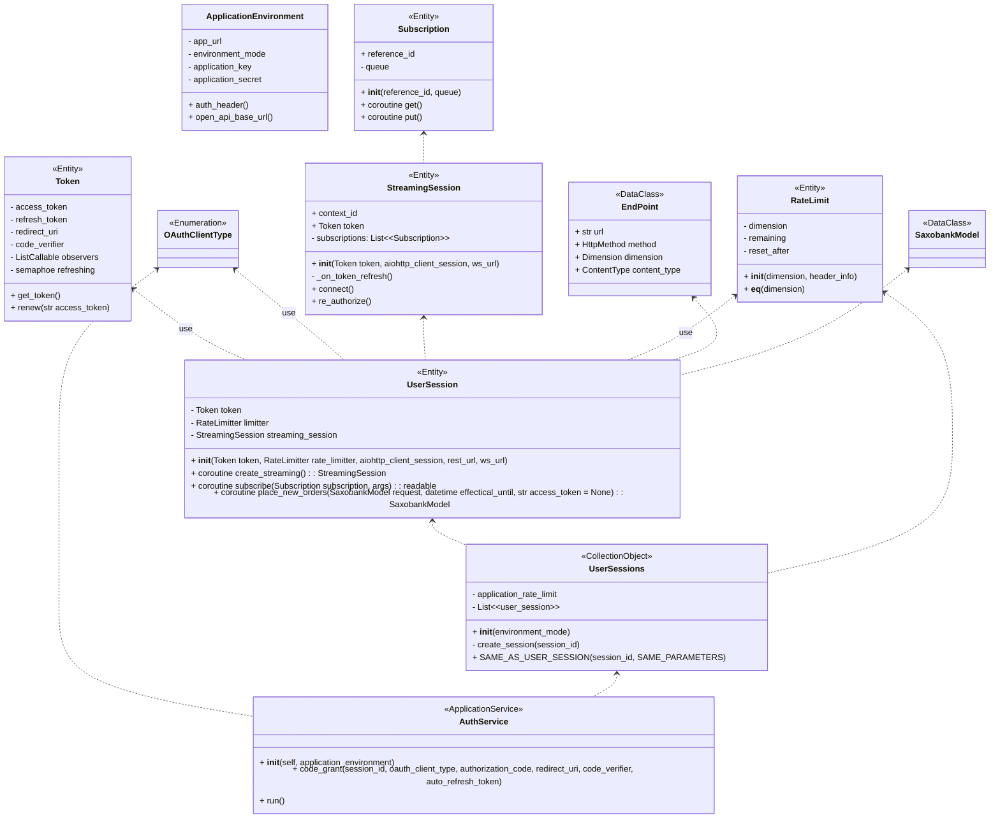

```mermaid
classDiagram

    class ApplicationEnvironment{
        - app_url
        - environment_mode
        - application_key
        - application_secret
        + auth_header()
        + open_api_base_url()
    }

    %% ==================== Session ==========================
    class Token{
        <<Entity>>
        - access_token
        - refresh_token
        - redirect_uri
        - code_verifier
        - ListCallable observers
        - semaphoe refreshing
        + get_token()
        + renew(str access_token)
    }
    class RateLimit {
        <<Entity>>
        - dimension
        - remaining
        - reset_after
        + __init__(dimension, header_info)
        + __eq__(dimension)
    }
    %%class TradeLevel {
    %%    <<Enumeration>> 
    %%}
    %%TradeLevel <.. SessionCapability
    %%class SessionCapability{
    %%    trade_level
    %%    NG: change_trade_level(trade_level)
    %%}
    %%class ContextId {
    %%    <<ValueObject>>
    %%    + __init__()
    %%}
    class Subscription{
        <<Entity>>
        + reference_id
        - queue
        + __init__(reference_id, queue)
        + coroutine get()
        + coroutine put()

    }
    %%ContextId <.. StreamingSession
    Subscription <.. StreamingSession
    class StreamingSession{
        <<Entity>>
        + context_id
        + Token token
        - subscriptions: List<~Subscription~>
        + __init__(Token token, aiohttp_client_session, ws_url)
        - _on_token_refresh()
        + connect()
        + re_authorize()
    }
    %%RateLimit <.. SessionRateLimits
    %%class SessionRateLimits {
    %%    <<CollectionObject>>
    %%    - List<~rate_limit~>
    %%    + apply(dimension, header_info)
    %%    + throttle_time(dimension, time)
    %%}
    class OAuthClientType{
        <<Enumeration>>
    }
    class EndPoint {
        <<DataClass>>
        + str url
        + HttpMethod method
        + Dimension dimension
        + ContentType content_type
    }
    class SaxobankModel{
        <<DataClass>>
    }
    %%ContextId <.. UserSession
    Token <.. UserSession: use
    OAuthClientType <.. UserSession: use
    StreamingSession <.. UserSession
    RateLimit <.. UserSession: use
    EndPoint <.. UserSession
    SaxobankModel <.. UserSession
    %%SessionRateLimits <.. UserSession: use
    %%SessionCapability <.. UserSession: has
    class UserSession{
        <<Entity>>
        - Token token
        - RateLimitter limitter
        %% - RateLimit application_rate_limit
        %%- session_rate_limits
        - StreamingSession streaming_session
        %%- context_association[context_id, streaming_session]
        + __init__(Token token, RateLimitter rate_limitter, aiohttp_client_session, rest_url, ws_url)
        %% + coroutine code_grant(oauth_client_type, app_key, app_secret, authorization_code, redirect_uri): bool
        %% + coroutine refresh_token(oauth_client_type, app_key, app_secret): bool
        + coroutine create_streaming(): StreamingSession
        + coroutine subscribe(Subscription subscription, args): readable
        %% OpenAPI accesses
        + coroutine place_new_orders(SaxobankModel request, datetime effectical_until, str access_token = None): SaxobankModel
    }

    UserSession <.. UserSessions
    RateLimit <.. UserSessions
    %% possible to have multiple sessions for a given user (by issuing multiple authorization tokens on the same user).
    class UserSessions{
        <<CollectionObject>>
        - application_rate_limit
        - List<~user_session~>
        + __init__(environment_mode)
        - create_session(session_id)
        + SAME_AS_USER_SESSION(session_id, SAME_PARAMETERS)
    }

    %% ==================== Auth ==========================
    OAuthClientType <.. AuthService
    UserSessions <.. AuthService
    class AuthService{
        <<ApplicationService>> 
        + __init__(self, application_environment)
        + code_grant(session_id, oauth_client_type, authorization_code, redirect_uri, code_verifier, auto_refresh_token)
        + run()
    }


```