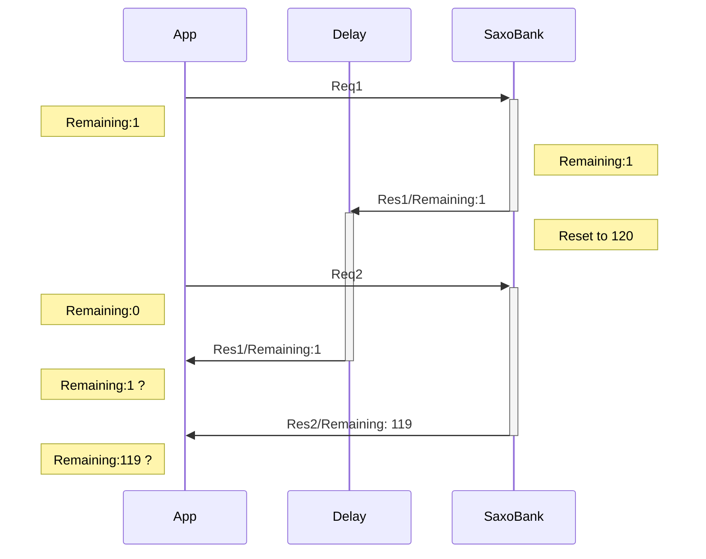
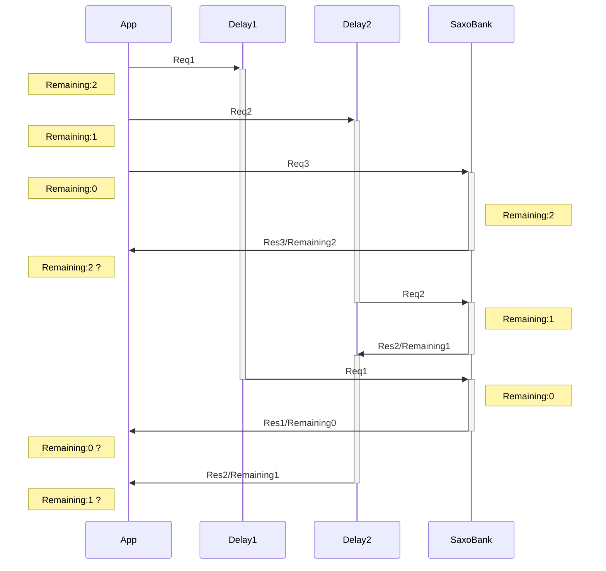

# Trade
## InfoPrice
- FieldGroup of Quote nothing returned when CFD/SPX. Maybe it used only FX, because described that "Fx Options can only be traded by accepting a quote" in https://www.developer.saxo/openapi/learn/trade
- However, SIM environment returns value.

# Session
## Token
### トークンはセッションが管理する
- Session has token. リクエストがトークンを渡すという考えもあるが、基本的に同一セッションに向けられたすべてのリクエストが同じトークンを使うこと、またSaxobankの記述にもトークンでオーソライズされたセッションはそれで一意に識別されるというニュアンスの記述（When an authorization token is issued it will contain an internal session id, that identifies the unique session. The session is always associated with the user (that provided credentials for the authorization token).）もあるので、リクエストがトークンを指定するというよりも、セッションがトークンを持つという考えが適切である。
- 通常のリクエスト・レスポンスだけを見れば、トークンのリフレッシュ処理自体はセッションの関心事ではないので、別途CodeGrantServiceのようなドメインサービスをつくり、トークンはユーザセッションと切り離してリフレッシュすることも考えられた。しかし、WebSocketではトークンがリフレッシュ後は再度WS側に更新通知を送らなければならず、そうなるとトークンがリフレッシュされたか否かはユーザセッションの関心事になってくる。これらを考えると、ユーザセッション側にリフレッシュ処理を設けた方が自然である。
### トークンはエンティティとする
トークンは値オブジェクトではなくエンティティとする。値オブジェクトとした場合、トークンRefreshにより変わった値オブジェクトを再度セッションに紐付けなければならず、
- トークン更新中であることをセッション側で管理し、その間の他のリクエストを止められるようにしなければならない。
- しかし、それがセッションの関心事かというと、どちらかと言えばトークンの関心事のように思える。

つまり、トークンはリフレッシュするという一連のライフサイクルを持つものである、と考えた方がわかりやすい。
ただし、エンティティはIDで一意に識別できるものとされているが、セッションと一対一で紐づくので、トークンにはエンティティとしての識別子は持たせる必要性が（今のところ）無い。

## Session Capability
- TradeLevel: OrderOnly or FullTradingAndChart
- Saxobank documant does not specifically describe about which type of access are allowed or not depends on trade level. Can not design using multiple session by its usage.
- Thus, assigning one session for one user is appropriate.
- ユーザは複数のセッションを保有できる。例えば、システムが作りやすいようにChartサービスグループアクセス用やTradeサービスグループアクセス用に分けることも可能。しかし、別セッションにした場合はFullAccessに出来るセッションがそのうちの1つに限定されてしまうはずなので、基本的にユーザあたり1つのセッション（aiohttp.ClientSession）とする。

## Binding to AIO HTTP
### HTTP Session
- Cookies and connectios are shared in same session.
- Can set default header for all session requests, and it useful for Authorization Header.
- Application may separate AIO HTTP session among saxobank session(user), since AIO HTTP session has function to set default header.

### Connector
- TCP or Unix connector
- Controls transport level; DNS Cache, IPv4 or 6, etc.
- However it's also ok to tweak connector among brokers, but separate it for connection requirements might differ by brokers.
- Use same connector for multiple session.

## Request/Response
### Access Limiting
RFCを参考にしていると思われるので参考に
https://datatracker.ietf.org/doc/html/draft-ietf-httpapi-ratelimit-headers

- Saxobankの仕様では、エンドポイントのサービスグループ別にリクエストがカウントされる旨が明記されている。
    - しかし、どのエンドポイントリクエストに対して何がカウントされるのかは明記されていない。
    - あるエンドポイントへのカウンタが、そのエンドポイント専用のものとは限らず、他のエンドポイントへのリクエストに対して共通してカウントされるかもしれない。
        - 実際に、port/v1/positions/とport/v1/orders/は、どちらもPortfolioMinuteというディメンションで管理されるカウンタを消費する。
    - エンドポイントへのリクエストURLとHTTP-Methodをキーに、レスポンスに格納されているディメンションをバリューとして、動的に辞書を作っても良いが、それだと仮に連続してアクセスする個別のエンドポイントが共通のカウンタで管理されていた場合に、初回はWait時間を無視してアクセスしてしまうことになる。
    - プログラムの実行時に動的に辞書を組み立てるのではなく、予めどのエンドポイントに対してどのディメンションが返されるのかを確認し、そのAs-Isの動作を基に辞書を作っておくしかない。
        - ディメンションの仕様が明記されていないので、不意に変わってしまうことが考えられる。それに備えて、想定したディメンションと異なっていた場合にシステムアラートを発行するのは有効である。
        - ディメンション毎に規定されているLimit値が突然変わることは想定すべきである。Limit値は固定ではなく、サーバの負荷状態に応じて動的に調整されるかもしれない。
- （セッション毎ではなく）アプリケーショングローバルのカウンタが存在する。しかし、このディメンション名も明記はされておらず、想定するしかない。
- Saxobankの仕様では、「リミットに達しそうな場合にはカウント情報を返却する」旨が明記されているので、この返却されるカウント情報のみでカウント管理する。
- 当たり前だが、カウント情報が必ずしも返却されないこと、カウント情報を伴わずに突然リクエスト過多エラーとされてしまう事態は想定すべきである。
- 大抵の場合において、Limit値回復のための待ち時間は長くはない。システム停止に備えて前回のカウンタ情報や待ち時間を保持しておく必要性は薄く、これらの情報を永続化するためのコストは妥当ではない。

#### Case1
- いつSaxoBank側のカウンタがリセットされるのか不明
    - アクセス許容量やLimit値回復のための所要時間は、「１日あたり何回」「１分あたり何回」などと規定されている。しかし、１日の始まりがどのタイムゾーンの何時を指すのか、またカウントは０秒から５９秒までの間で増えていくのか、それともカウントがリセットされて初回のアクセスから起算して１分以内なのか、詳細な仕様は記されていない。
    - 当然ながら、カウンタはサーバで処理した時間でカウントされる。クライアント側で現在のカウントや待ち時間を管理したところで、正しいのはサーバであり、クライアントは常に厳密ではない。

#### Case2
- Saxobankからのレスポンスだからというだけでは、そのRemaining情報を適用できない
- 順番は保証されていない

### 対処
- Requestを送信した数に対しResponseのあった数を比較し、同一になった場合にのみ、そのRateLimit情報のみ適用する。
- ResponseのDateヘッダを参照し、直近のResponseより古ければRateLimit情報は読み捨てる。
    - Res2のRemaining:1は読み捨てられる

# WeboSkect
Use Cases are..
- Chart
    - Prefetch prices of Asset/UIC
    - Stop prefetch
    - 購読状態は永続化し、切断・コネクションエラーからの復旧時は再接続したい。その間バッファされた情報はあれば良いかもしれないが、無くても構わない。
- ENS (Event Notification Services)
    - Get client activity of type(MerginCalls, Orders, Positions, etc..) and make it notifiable.
    - Stop these.
    - 購読状態は永続化し、切断・コネクションエラーからの復旧時は再接続したい。その間バッファされた情報は再接続時に配信してもらいたい。
- Portfolio/Orders
    - Aware that order takes position.
    - Stop it.
- Portfolio/Positions
    - Aware that position closed.
    - Stop it.
- Root Services/Sessions
    - Watch session capability to tradable.
    - Stop it.
- Trading/InfoPrices
    - Same as Chart (difference?)
- Trading/Messages
    - Notification to user.
    - Stop it.
- Trading/Prices
    -  Same as Chart (difference?)

## Subscription
- ContextIDとReferenceIDで識別される。
- コルーチンでのデータ提供にすることも考えたが、大本のStreamingSessionからReferenceに該当するものだけをQueueに詰め込んで、それを読んでもらう形になるので、直接WebSocketのListen処理とは繋がるわけではない。もしアプリケーション側からCloseしたい場合、直にStreamingSessionにエラーが上がるわけではなく、間に挟む配信オブジェクトにエラーが上がるだけなので、冗長になるだけ。よって、アプリケーション側からはID管理のうえで指定されたIDでのCreateと、IDを指定してのCloseを設ける形にした方が良い。
### Resetting Subscription
- 配信上のエラーが発生した場合は新しいReference IDで再度サブスクライブする必要がある。
- 配信上のエラーはアプリケーション側の関心事項ではなく、Subscription取得処理側の関心事項としたい。とすれば、
    - アプリケーション側にReference IDを意識させてはならない
    - リセットに伴いSubscription自体のインスタンスが変わったことを、アプリケーション側に隠匿する必要がある
## Data Message
- 以下の理由により、アプリケーション側にはData Messageをそのまま渡したり、Delta圧縮されたまま渡すのではなく、スナップショット適用された状態のメッセージを正しい順序で送るべきである。
    - Data Messageには、Subscription自体に対するコントロールメッセージが送られてくる場合もある。それはアプリケーション側ではなく基板側で対処するべきものである。
    - スナップショットはSubscription開始時点のレスポンスに含まれており、そのリクエストは基板側で透過的に行いたい。それであれば、スナップショットの存在自体を隠蔽した方が、アプリケーション側からは扱いやすい。

